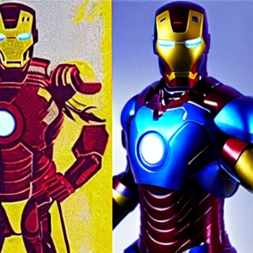

# AI-ImageGeneration-Storyteller

## In this project, I have developed two generative AI models:
> - Generating images from text using Stable Diffusion. 
> - Generating stories from text using Causal Language Modeling. 
> - I've also utilized Streamlit, allowing to effortlessly interact with and explore these remarkable AI creations. 
 

## Stable-Diffusion model:

The image generation component utilizes <strong>LoRA fine-tuning</strong>, applied on top of a pre-trained "stable-diffusion-v1-4" model. This allows the model to create high-quality images based on textual prompts, enabling users to visualize their ideas with artistic and realistic images.

 

### Here are some examples of the model outputs...
### Entering to the prompt : `Alien sitting on table`

    
    
    
    
    

 

### Entering to the prompt : `Alien in desert`

    
    
    
    
    

 

### Entering to the prompt : `Batman wearing captain America suit`

    
    
    
    
    

 

### Entering to the prompt : `Batman pink suit`

    
    
    
    
    

 

### Entering to the prompt : `Blue golden Iron man`

    
    
    
    
    

 

### Entering to the prompt : `Blue cat in jungle`

    
    
    
    
    

 

### Entering to the prompt : `Green dog with red eyes`

    
    
    
    
    

 

### Entering to the prompt : `Green elephant near the sea`

    
    
    
    
    

 

### Entering to the prompt : `Red polar bear in snow`

    
    
    
    
    

 

### Entering to the prompt : `Strange creature in the sea`

    
    
    
    
    

 

### Entering to the prompt : `Egypt pyramids in the ice`

    
    
    
    
    

  

## Story-Generation model:

The story generation functionality is achieved by <strong>full fine-tuning</strong> a pre-trained decoder model "GPT-2" on a <strong>dataset of narrative texts.</strong> The model is trained to generate coherent and engaging stories, leveraging its language understanding capabilities.

Also I added 6 stories genre type to enhance the creativity !!

 

### Here are some examples of the model outputs...

### Entering to the prompt : `Alien` and choosing `thriller` to generate the story

    

 

### Entering to the prompt : `Robot army` and choosing `horror` to generate the story

    

 

### Entering to the prompt : `A young boy` and choosing `superhero` to generate the story

    

 

## Streamlit Framework:

The interactive user interface is developed using Streamlit, a powerful Python library. It enables seamless integration of the AI models with user input and output, creating a user-friendly experience for generating captivating stories and stunning images effortlessly.

 

### Here are some screenshots from the app to see how it looks like...

### Entering to the prompt : `The main page`

    

 

### Entering to the prompt : `After choosing text to image generation`

    

 

### Entering to the prompt : `After choosing story generation`

    

 

# Finally more will be added...
